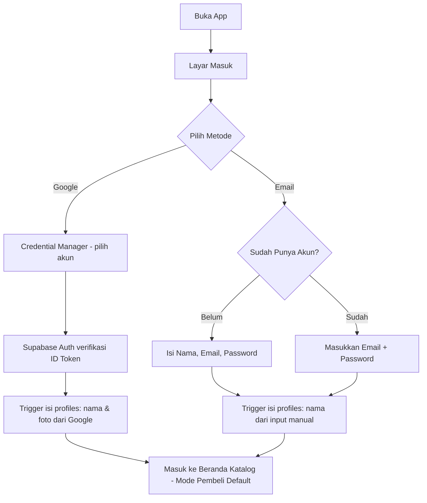
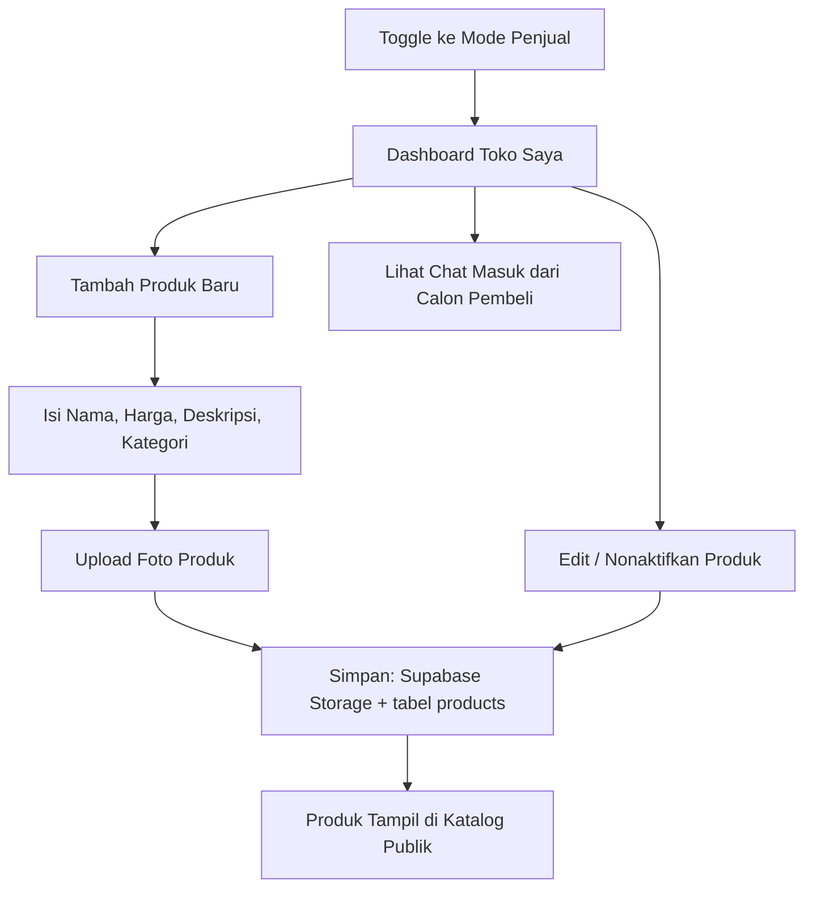
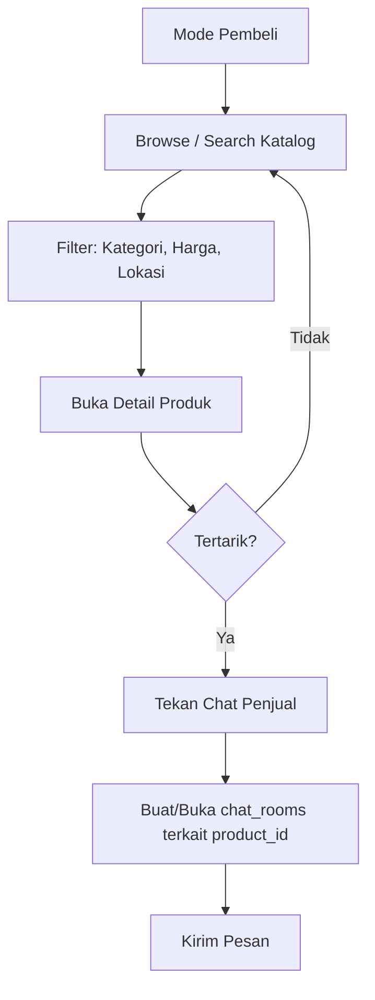
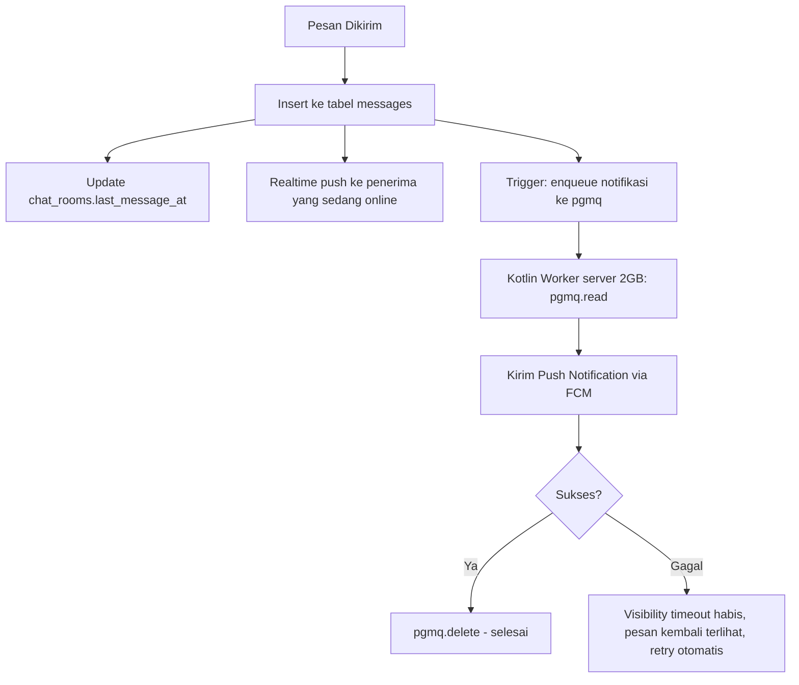
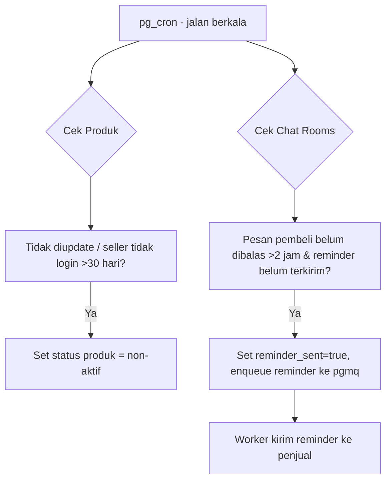
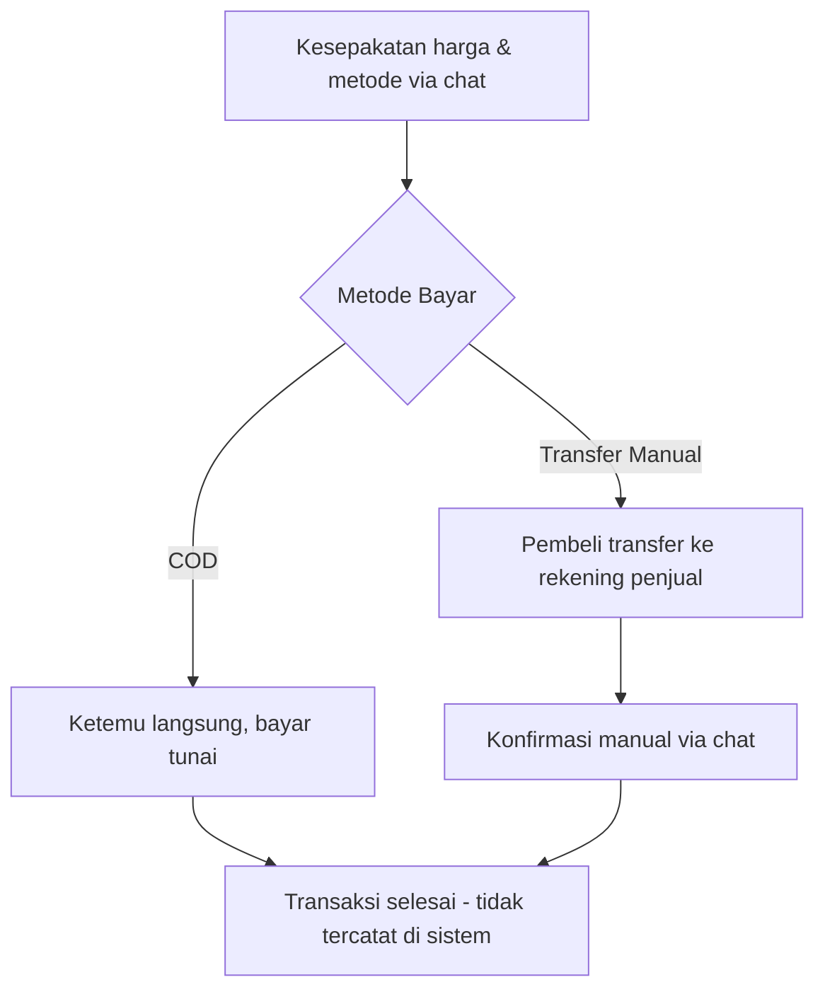
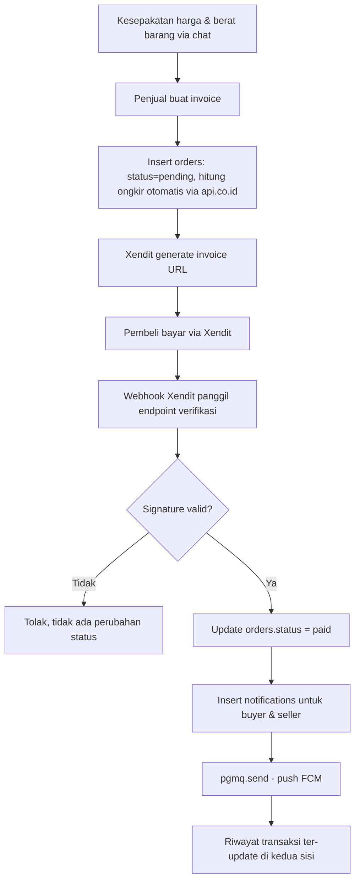
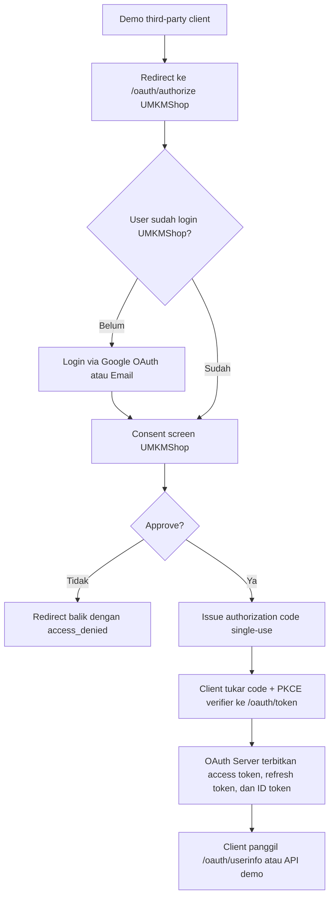
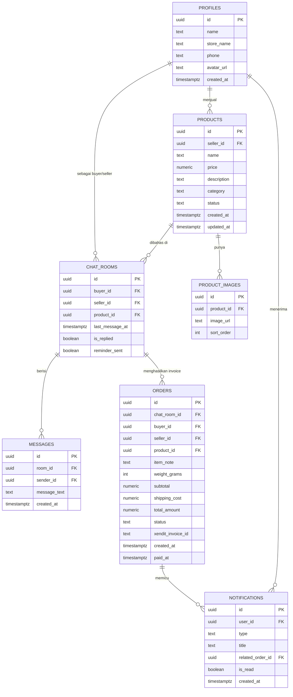

# PRD: Aplikasi Marketplace UMKM (Mobile)

**Status:** Draft v1.2 (update pivot B2B, payment gateway Fase 3, dan OAuth learning track)
**Platform:** Android Native (Kotlin + Jetpack Compose)
**Model:** Marketplace B2B bahan baku/setengah jadi — penjual menjual bahan mentah/komponen (bahan makanan, bahan minuman belum diolah, komponen motor/HP/IoT), pembeli adalah bisnis yang mengolahnya jadi produk akhir. Katalog + chat untuk negosiasi, pembayaran via Xendit setelah harga disepakati (mulai Fase 3).

---

## 1. Ringkasan & Latar Belakang

Aplikasi ini menghubungkan penjual bahan baku/setengah jadi dengan pembeli bisnis melalui **katalog produk** dan **chat langsung** untuk negosiasi harga. Sejak Fase 3, transaksi tercatat di sistem: setelah harga disepakati di chat, penjual generate invoice (Xendit), pembeli bayar, status & riwayat transaksi tersimpan otomatis. Di Fase 1–2 (sebelum Fase 3), kesepakatan harga & pembayaran masih diselesaikan pembeli-penjual sendiri di luar sistem (COD/transfer manual) — lihat §5.6 untuk kedua versi alur ini. Mulai Fase 3 juga ada jalur **pembelajaran identity platform**: login utama tetap Google OAuth/Email, sementara OAuth Server UMKMShop dibuat sebagai modul learning di backend Kotlin/Ktor tunggal agar konsep authorization code, PKCE, refresh token, dan JWKS bisa dipelajari tanpa mengganggu flow marketplace utama.

Prioritas produk: **time-to-market cepat, biaya infrastruktur rendah, kode mudah dikembangkan lebih lanjut.**

---

## 2. Tujuan Produk (Goals)

- Memberi UMKM tempat memajang produk tanpa perlu bikin toko online sendiri.
- Mempertemukan pembeli-penjual lewat chat yang terhubung langsung ke produk yang ditanyakan (bukan chat generik).
- Rilis MVP secepat mungkin dengan biaya operasional minimal.
- Arsitektur yang mudah diperluas (payment gateway, rating, dll) tanpa refactor besar.

## 3. Non-Goals (Di Luar Scope MVP, Sebagian Masuk Fase 3)

- Payment gateway/escrow — **bukan lagi non-goal permanen**, ini sudah masuk cakupan Fase 3 (Xendit, lihat `GOALS3.md`). Di MVP (Fase 1) tetap di luar sistem.
- Sistem pengiriman terintegrasi — **sebagian masuk Fase 3** (estimasi ongkir otomatis via api.co.id), tapi tracking pengiriman fisik/kurir tetap di luar cakupan.
- OAuth Server untuk pihak ketiga produksi — **masuk sebagai learning track Fase 3**, tetapi belum menjadi kontrak bisnis eksternal/partner resmi sampai security review dan hardening selesai.
- iOS (dievaluasi ulang setelah validasi Android).
- Rating & review penjual (Fase 2+).
- Sistem lelang / tawar-menawar terstruktur di dalam app — negosiasi tetap lewat chat bebas, bukan fitur tawar terstruktur.

## 4. Target Pengguna & Peran

| Peran | Deskripsi |
|---|---|
| **Penjual (Seller)** | Pemasok bahan baku/setengah jadi & komponen — kategori: bahan makanan, bahan minuman belum diolah, komponen motor, komponen HP, komponen IoT |
| **Pembeli (Buyer)** | Bisnis yang mengolah bahan/komponen itu jadi produk akhir (contoh: usaha kue membeli madu mentah sebagai bahan) — bukan konsumen akhir |

Satu akun bisa berperan sebagai penjual sekaligus pembeli (mode bisa ditoggle, bukan dua akun terpisah).

---

## 5. Alur Bisnis Utama (Business Flow)

### 5.1 Onboarding & Autentikasi

> Untuk jalur **Google**, login & register tetap satu langkah (trigger `handle_new_user` ambil nama/foto dari Google). Untuk jalur **Email**, login & register tetap dua form terpisah seperti auth berbasis password pada umumnya — karena tidak ada data profil yang bisa diambil otomatis dari pihak ketiga.
>
> **Lupa Password** (reset via email saat terkunci dari akun) **wajib ada** selama jalur email aktif — beda dari **Ganti Password** (ubah password saat sudah login, di halaman Profile) yang masih boleh backlog sesuai §6.4. Tanpa jalur reset, user email yang lupa password akan terkunci permanen; user Google tidak pernah menghadapi masalah ini.
>
> **OAuth Server UMKMShop bukan jalur login utama Android.** Modul itu dibuat untuk pembelajaran identity platform: user tetap login ke UMKMShop lewat Google OAuth/Email, lalu OAuth Server menerbitkan authorization code/token untuk demo client pihak ketiga yang terdaftar.

### 5.2 Alur Penjual: Kelola Produk

### 5.3 Alur Pembeli: Cari & Tanya Produk

### 5.4 Alur Chat & Notifikasi (Background Processing)

### 5.5 Alur Housekeeping Terjadwal (pg_cron)

### 5.6 Alur Transaksi

**Versi Fase 1–2 (sebelum payment gateway):**

**Versi Fase 3 (Xendit, tercatat sebagai `orders`):**

> Sejak Fase 3, status transaksi (`pending`/`paid`/`expired`/`cancelled`) adalah **satu sumber kebenaran** di tabel `orders` — bukan lagi asumsi "selesai di luar sistem". Detail skema & keputusan webhook ada di `BACKEND_SPEC-v2.md §8` dan `PLAN3.md Tahap D`.

### 5.7 Alur OAuth Server UMKMShop (Learning Track)

> Flow ini dibuat untuk pembelajaran OAuth 2.1/OpenID Connect. Android app marketplace tidak perlu menjadi OAuth client dari server ini untuk fitur harian; Android tetap memakai Supabase session yang sudah ada. OAuth Server harus diperlakukan sebagai boundary security terpisah dan tidak boleh memakai secret di client publik.

---

## 6. Fitur & Requirement Detail

### 6.1 Katalog Produk
- List produk dengan pagination, thumbnail, nama, harga.
- Search berbasis nama/kategori.
- Filter dasar: kategori, rentang harga.
- Detail produk: foto (multi-gambar), deskripsi, info penjual, tombol chat.
- Mode penjual: CRUD produk milik sendiri, upload/hapus foto.

### 6.2 Chat Realtime
- Satu `chat_room` = kombinasi unik (buyer_id, seller_id, product_id).
- Riwayat pesan tersimpan permanen.
- Update realtime via Supabase Realtime saat kedua pihak online.
- Badge pesan belum dibaca.

### 6.3 Notifikasi Push
- Trigger otomatis saat ada pesan baru dan penerima tidak sedang membuka chat tsb.
- Dikirim via FCM, diproses oleh background worker di backend Kotlin/Ktor (lihat §8) agar tidak memblokir pengiriman chat.
- Reminder otomatis ke penjual jika pesan pembeli tidak dibalas dalam 2 jam.

### 6.4 Manajemen Akun & Role
- Satu akun, dua identitas: **nama** (tampil sebagai pembeli) dan **nama toko** (tampil sebagai penjual) — bukan dua akun terpisah.
- **Navigasi bottom nav berbeda per mode:**
  - Mode Pembeli: `Produk` (katalog) · `Chat` · `Profile`
  - Mode Penjual: `Toko` (dashboard produk milik sendiri, menggantikan tab Produk) · `Chat` · `Profile`
- **Toggle mode Pembeli ⇄ Penjual dilakukan dari halaman Profile** — bukan tombol global di header, supaya tidak mengganggu alur browsing/chat yang sedang berjalan.
- Profil dasar: nama, foto, nomor HP/WA (opsional ditampilkan ke pembeli yang sudah chat). **Lupa Password** (reset via email) tersedia sejak MVP karena jalur Email/Password aktif — ini bukan fitur opsional. **Ganti Password** (edit di halaman Profile saat sudah login) dan **Edit Identitas** tetap belum tersedia di MVP — dicatat sebagai backlog, bukan terlewat.

### 6.5 Riwayat Transaksi (Fase 3)
- List `orders` milik user — sebagai buyer maupun seller, ditandai beda.
- Status ditampilkan jelas: pending (kuning), paid (hijau), expired/cancelled (abu-abu/merah).
- Setiap entri menunjukkan: produk terkait, subtotal, ongkir, total, link ke chat room asal negosiasi.
- Tidak ada aksi refund otomatis di UI — sengketa/refund ditangani manual di luar app untuk saat ini.

### 6.6 Inbox (Fase 3)
- **Berbeda dari tab Chat** — Inbox khusus notifikasi pesanan & pembayaran (invoice baru, status dibayar/kedaluwarsa), bukan isi percakapan.
- Dibuka lengkap dari halaman **Profile**.
- Badge ringkas (jumlah belum dibaca) juga muncul di halaman **Toko** dan **Produk** — supaya penjual/pembeli tidak perlu buka Profile dulu untuk sadar ada pembaruan pesanan.
- Bukan wishlist/favorit — fitur itu sudah diganti dengan Inbox sejak keputusan Fase 3 (lihat `PLAN2.md` Tahap A untuk versi lama yang sudah tidak berlaku).

### 6.7 OAuth Server UMKMShop (Fase 3 Learning Track)
- Tujuan utama adalah pembelajaran, bukan membuka integrasi partner produksi.
- Mendukung Authorization Code + PKCE untuk public client.
- Mendukung confidential client hanya jika client secret disimpan dan dibandingkan secara hashed, bukan plaintext.
- Endpoint minimal: `/.well-known/openid-configuration`, `/oauth/authorize`, `/oauth/token`, `/oauth/userinfo`, `/oauth/jwks.json`, `/oauth/revoke`.
- Scope awal dibatasi ke `openid`, `email`, dan `profile`.
- Redirect URI harus exact match, tanpa wildcard.
- Authorization code single-use dan short-lived.
- Refresh token harus rotatable dan disimpan hashed.
- JWT ditandatangani dengan asymmetric key; public key diekspos lewat JWKS.
- Consent screen harus menampilkan nama client, redirect URI, dan scope yang diminta.

---

## 7. Skema Data

Catatan: antrean notifikasi **tidak** pakai tabel custom — ditangani ekstensi `pgmq` (Supabase Queues), lihat §8. Tabel `NOTIFICATIONS` di atas beda dari `pgmq`: itu penyimpanan permanen untuk fitur Inbox (§6.6), sedangkan `pgmq` cuma jalur pengiriman push yang transient. Detail lengkap skema `orders`/`notifications` ada di `BACKEND_SPEC-v2.md` dan `PLAN3.md`.

---

## 8. Arsitektur Teknis (Ringkasan Keputusan)

| Layer | Pilihan | Alasan Singkat |
|---|---|---|
| Mobile | Android native — Kotlin + Jetpack Compose | Dominasi pasar Android Indonesia, tooling resmi kuat, maintenance satu platform di MVP |
| Backend inti | Supabase Cloud (Postgres, Auth, Storage, Realtime) | Time-to-market cepat, biaya rendah, tidak perlu bangun infra dari nol |
| Queue notifikasi | Supabase Queues (`pgmq`) | Durable, guaranteed delivery, native Postgres — bukan bikin tabel antrean manual |
| Scheduler | `pg_cron` | Cleanup produk basi & reminder chat, tanpa server tambahan |
| Backend learning app | Kotlin/Ktor stateless di server 2GB | Satu process/container menjalankan HTTP OAuth learning, `/health`, dan background worker `pgmq.read()` → FCM → `pgmq.delete()` |
| OAuth Server learning | Route HTTP di backend Kotlin/Ktor tunggal | Belajar OAuth/OIDC tanpa mengubah auth utama Android; bukan service/microservice terpisah |

Server 2GB **tidak** menjalankan database atau queue utama — hanya backend Kotlin/Ktor ringan yang melayani endpoint learning dan polling/kirim notifikasi. Batas memori JVM disarankan `-Xms256m -Xmx512m`, pool koneksi DB kecil (4–8).

---

## 9. Non-Functional Requirements

- **Efisiensi resource:** backend di server 2GB harus stateless & idempotent untuk job background (aman di-restart kapan saja tanpa duplikasi notifikasi).
- **Startup MVP tanpa biaya server tambahan:** semua fitur inti (auth, katalog, chat, queue, cron) jalan di tier gratis/murah Supabase Cloud.
- **Skalabilitas bertahap:** arsitektur queue (pgmq) cukup untuk traffic puluhan–ratusan notifikasi/menit; migrasi ke Redis Streams/RabbitMQ baru relevan jika traffic naik ke level ratusan–ribuan/detik.
- **Ketahanan data:** riwayat chat & produk tidak boleh hilang meski worker/server mati.

## 10. Metrik Keberhasilan (Success Metrics)

- Jumlah produk aktif per minggu.
- Waktu rata-rata penjual membalas chat pertama.
- Rasio chat yang berlanjut menjadi percakapan >2 pesan (proxy minat transaksi).
- Retensi penjual (kembali update/tambah produk dalam 30 hari).
- Delivery rate notifikasi push (berhasil terkirim vs gagal/token invalid).

## 11. Rencana Rilis

**Fase 1 — MVP**
Auth, CRUD produk + upload foto, katalog + search dasar, chat realtime, notifikasi push (pgmq + worker), cron cleanup & reminder.

**Fase 2 — Setelah Validasi**
Wishlist/favorit produk, rating penjual, filter lokasi/radius, optimasi search, moderasi konten produk.

**Fase 3 — Payment Gateway, Pivot B2B, dan OAuth Learning Track**
Kategori produk bahan baku/komponen, payment gateway Xendit (invoice dibuat penjual setelah nego di chat), riwayat transaksi, Inbox (notifikasi pesanan/pembayaran, terpisah dari Chat), ongkir otomatis via api.co.id, Google OAuth native, dan OAuth Server UMKMShop untuk pembelajaran. Detail lengkap di `GOALS3.md` dan `PLAN3.md`.

## 12. Risiko & Mitigasi

| Risiko | Mitigasi |
|---|---|
| Server 2GB single point of failure untuk backend learning app | Backend stateless, restart aman, antrean tetap di Postgres |
| Limit tier gratis Supabase terlampaui | Monitor usage dashboard, siapkan jalur upgrade tier |
| Token FCM invalid/expired | Hapus token dari DB saat FCM merespons invalid, log untuk observability |
| Produk spam/tidak relevan | Moderasi manual sederhana di Fase 1, sistem report di Fase 2 |
| OAuth Server learning disalahartikan sebagai production-ready IdP | Tandai sebagai learning track, batasi scope/client, wajib security checklist sebelum dipakai partner nyata |

## 13. Pertanyaan Terbuka

- Nama & branding aplikasi.
- Lokasi endpoint webhook Xendit: Supabase Edge Function atau Kotlin worker HTTP listener.
- Domain issuer OAuth Server UMKMShop untuk learning (`auth.umkmshop...`) dan secret storage production untuk signing key/token pepper.
