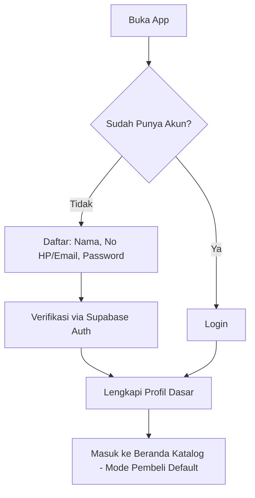
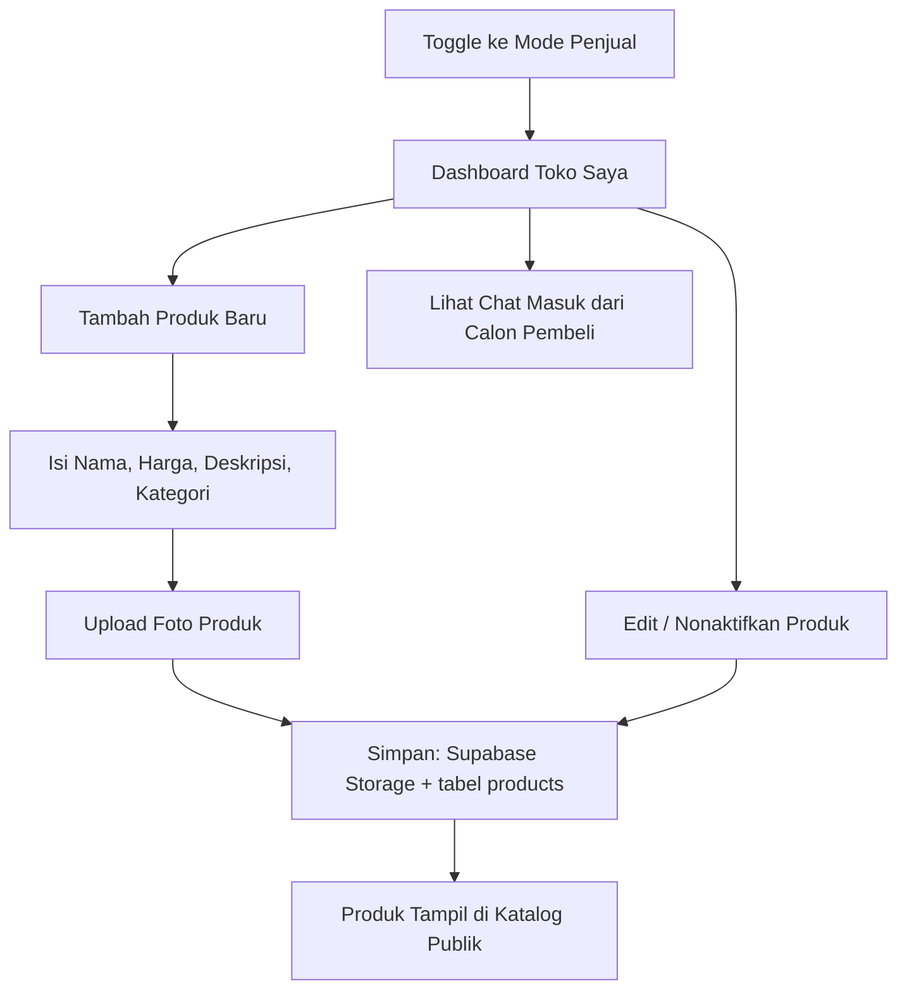
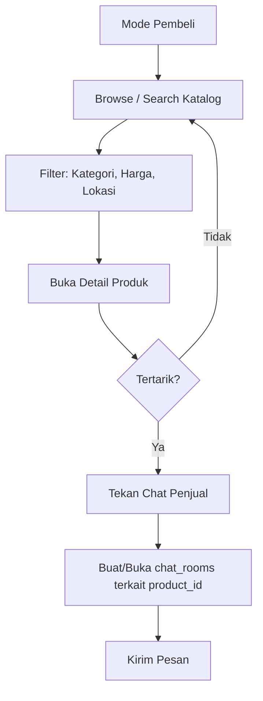
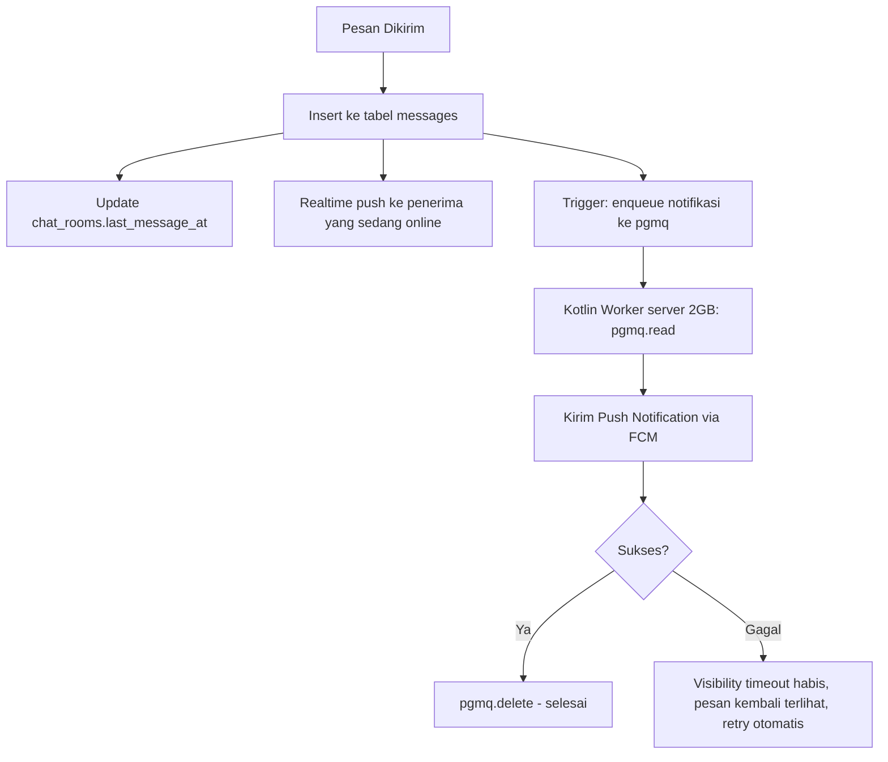
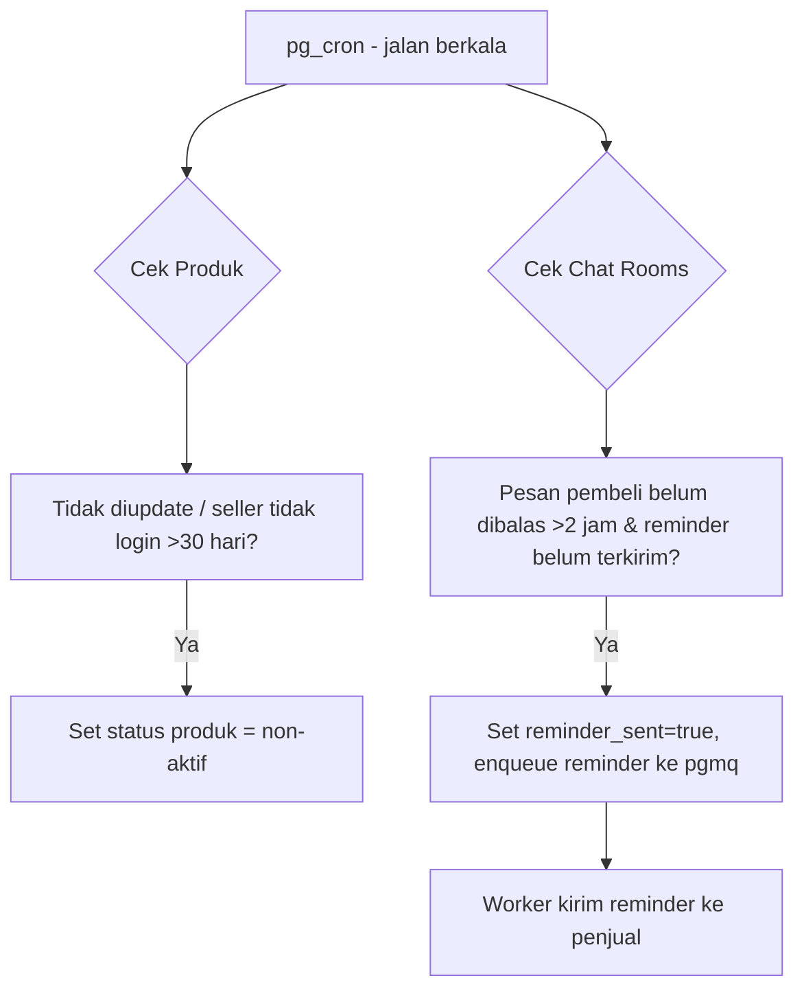
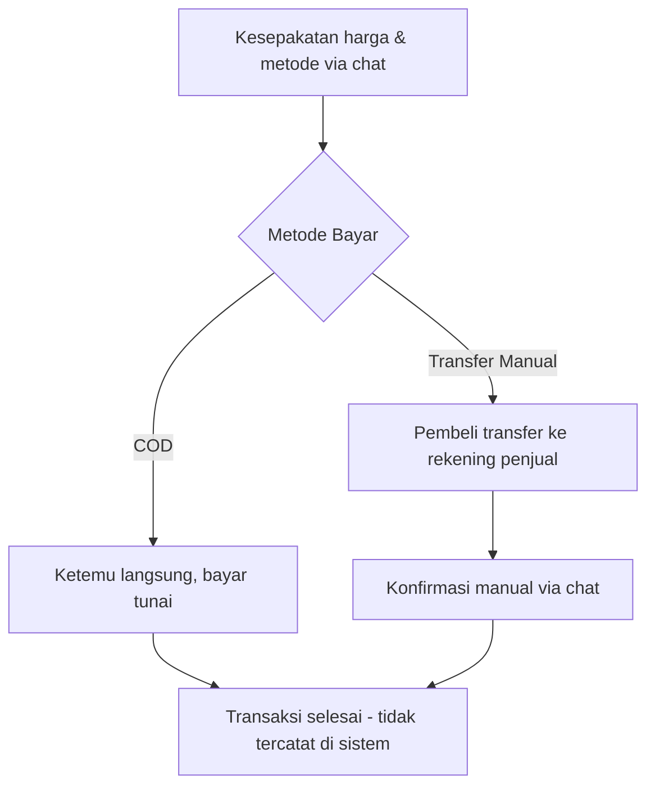
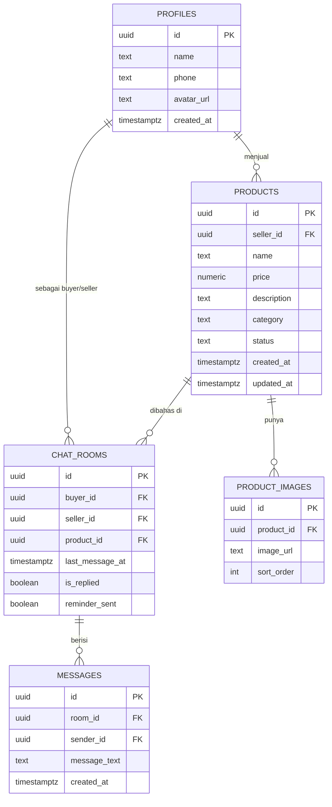

# PRD: Aplikasi Marketplace UMKM (Mobile)

**Status:** Draft v1.0
**Platform:** Android Native (Kotlin + Jetpack Compose)
**Model:** Marketplace ala Facebook Marketplace — katalog + chat, transaksi (COD/transfer manual) di luar sistem

---

## 1. Ringkasan & Latar Belakang

Aplikasi ini menghubungkan penjual UMKM dengan pembeli melalui dua fitur inti: **katalog produk** dan **chat langsung**. Tidak ada payment gateway di MVP — kesepakatan harga, metode bayar, dan pengiriman diselesaikan pembeli-penjual sendiri via chat, lalu COD atau transfer manual.

Prioritas produk: **time-to-market cepat, biaya infrastruktur rendah, kode mudah dikembangkan lebih lanjut.**

---

## 2. Tujuan Produk (Goals)

- Memberi UMKM tempat memajang produk tanpa perlu bikin toko online sendiri.
- Mempertemukan pembeli-penjual lewat chat yang terhubung langsung ke produk yang ditanyakan (bukan chat generik).
- Rilis MVP secepat mungkin dengan biaya operasional minimal.
- Arsitektur yang mudah diperluas (payment gateway, rating, dll) tanpa refactor besar.

## 3. Non-Goals (Di Luar Scope MVP)

- Payment gateway / escrow.
- Sistem pengiriman terintegrasi (kurir, tracking).
- iOS (dievaluasi ulang setelah validasi Android).
- Rating & review penjual (Fase 2+).
- Sistem lelang / tawar-menawar terstruktur di dalam app.

## 4. Target Pengguna & Peran

| Peran | Deskripsi |
|---|---|
| **Penjual (Seller)** | Pelaku UMKM yang upload & kelola produk |
| **Pembeli (Buyer)** | Mencari produk, chat penjual, sepakat transaksi di luar app |

Satu akun bisa berperan sebagai penjual sekaligus pembeli (mode bisa ditoggle, bukan dua akun terpisah).

---

## 5. Alur Bisnis Utama (Business Flow)

### 5.1 Onboarding & Autentikasi

### 5.2 Alur Penjual: Kelola Produk

### 5.3 Alur Pembeli: Cari & Tanya Produk

### 5.4 Alur Chat & Notifikasi (Background Processing)

### 5.5 Alur Housekeeping Terjadwal (pg_cron)

### 5.6 Alur Transaksi (Di Luar Sistem)

> Catatan: karena transaksi terjadi di luar sistem, app tidak perlu (dan sengaja tidak) melacak status "terjual/lunas" di MVP ini.

---

## 6. Fitur & Requirement Detail

### 6.1 Katalog Produk
- List produk dengan pagination, thumbnail, nama, harga.
- Search berbasis nama/kategori.
- Filter dasar: kategori, rentang harga.
- Detail produk: foto (multi-gambar), deskripsi, info penjual, tombol chat.
- Mode penjual: CRUD produk milik sendiri, upload/hapus foto.

### 6.2 Chat Realtime
- Satu `chat_room` = kombinasi unik (buyer_id, seller_id, product_id).
- Riwayat pesan tersimpan permanen.
- Update realtime via Supabase Realtime saat kedua pihak online.
- Badge pesan belum dibaca.

### 6.3 Notifikasi Push
- Trigger otomatis saat ada pesan baru dan penerima tidak sedang membuka chat tsb.
- Dikirim via FCM, diproses oleh worker terpisah (lihat §8) agar tidak memblokir pengiriman chat.
- Reminder otomatis ke penjual jika pesan pembeli tidak dibalas dalam 2 jam.

### 6.4 Manajemen Akun & Role
- Satu akun, toggle mode Pembeli ⇄ Penjual.
- Profil dasar: nama, foto, nomor HP/WA (opsional ditampilkan ke pembeli yang sudah chat).

---

## 7. Skema Data

Catatan: antrean notifikasi **tidak** pakai tabel custom — ditangani ekstensi `pgmq` (Supabase Queues), lihat §8.

---

## 8. Arsitektur Teknis (Ringkasan Keputusan)

| Layer | Pilihan | Alasan Singkat |
|---|---|---|
| Mobile | Android native — Kotlin + Jetpack Compose | Dominasi pasar Android Indonesia, tooling resmi kuat, maintenance satu platform di MVP |
| Backend inti | Supabase Cloud (Postgres, Auth, Storage, Realtime) | Time-to-market cepat, biaya rendah, tidak perlu bangun infra dari nol |
| Queue notifikasi | Supabase Queues (`pgmq`) | Durable, guaranteed delivery, native Postgres — bukan bikin tabel antrean manual |
| Scheduler | `pg_cron` | Cleanup produk basi & reminder chat, tanpa server tambahan |
| Background worker | Kotlin/Ktor stateless di server 2GB | `pgmq.read()` → kirim FCM → `pgmq.delete()`; kalau server restart, antrean tidak hilang karena disimpan di Postgres |

Server 2GB **tidak** menjalankan database atau queue utama — hanya worker ringan yang polling & kirim notifikasi. Batas memori JVM disarankan `-Xms256m -Xmx512m`, pool koneksi DB kecil (4–8).

---

## 9. Non-Functional Requirements

- **Efisiensi resource:** worker di server 2GB harus stateless & idempotent (aman di-restart kapan saja tanpa duplikasi notifikasi).
- **Startup MVP tanpa biaya server tambahan:** semua fitur inti (auth, katalog, chat, queue, cron) jalan di tier gratis/murah Supabase Cloud.
- **Skalabilitas bertahap:** arsitektur queue (pgmq) cukup untuk traffic puluhan–ratusan notifikasi/menit; migrasi ke Redis Streams/RabbitMQ baru relevan jika traffic naik ke level ratusan–ribuan/detik.
- **Ketahanan data:** riwayat chat & produk tidak boleh hilang meski worker/server mati.

## 10. Metrik Keberhasilan (Success Metrics)

- Jumlah produk aktif per minggu.
- Waktu rata-rata penjual membalas chat pertama.
- Rasio chat yang berlanjut menjadi percakapan >2 pesan (proxy minat transaksi).
- Retensi penjual (kembali update/tambah produk dalam 30 hari).
- Delivery rate notifikasi push (berhasil terkirim vs gagal/token invalid).

## 11. Rencana Rilis

**Fase 1 — MVP**
Auth, CRUD produk + upload foto, katalog + search dasar, chat realtime, notifikasi push (pgmq + worker), cron cleanup & reminder.

**Fase 2 — Setelah Validasi**
Wishlist/favorit produk, rating penjual, filter lokasi/radius, optimasi search, moderasi konten produk.

**Fase 3 — Evaluasi Skala**
Payment gateway (opsional), evaluasi iOS/cross-platform, migrasi queue ke Redis Streams jika traffic tinggi.

## 12. Risiko & Mitigasi

| Risiko | Mitigasi |
|---|---|
| Server 2GB single point of failure untuk worker | Worker stateless, restart aman, antrean tetap di Postgres |
| Limit tier gratis Supabase terlampaui | Monitor usage dashboard, siapkan jalur upgrade tier |
| Token FCM invalid/expired | Hapus token dari DB saat FCM merespons invalid, log untuk observability |
| Produk spam/tidak relevan | Moderasi manual sederhana di Fase 1, sistem report di Fase 2 |

## 13. Pertanyaan Terbuka

- Nama & branding aplikasi.
- Taksonomi kategori produk (perlu daftar awal kategori UMKM yang relevan).
- Apakah perlu filter lokasi berbasis radius/kota di MVP, atau cukup teks lokasi bebas dulu?
- Kebijakan moderasi produk: pre-moderasi sebelum tayang, atau post-moderasi + report?